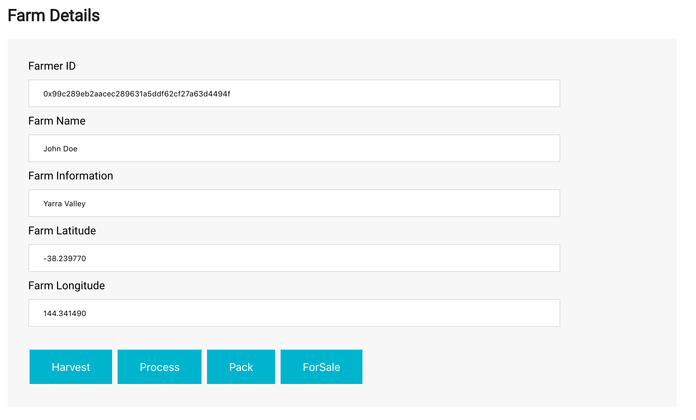

# Supply chain & data auditing

This repository containts an Ethereum DApp that demonstrates a Supply Chain flow between a Seller and Buyer. The user story is similar to any commonly used supply chain process. A Seller can add items to the inventory system stored in the blockchain. A Buyer can purchase such items from the inventory system. Additionally a Seller can mark an item as Shipped, and similarly a Buyer can mark an item as Received.

The DApp User Interface when running should look like...





## Getting Started

These instructions will get you a copy of the project up and running on your local machine for development and testing purposes. See deployment for notes on how to deploy the project on a live system.

### Prerequisites

Please make sure you've already installed ganache-cli, Truffle and enabled MetaMask extension in your browser.

```
Give examples (to be clarified)
```

### Installing

> The starter code is written for **Solidity v0.4.24**. At the time of writing, the current Truffle v5 comes with Solidity v0.5 that requires function *mutability* and *visibility* to be specified (please refer to Solidity [documentation](https://docs.soliditylang.org/en/v0.5.0/050-breaking-changes.html) for more details). To use this starter code, please run `npm i -g truffle@4.1.14` to install Truffle v4 with Solidity v0.4.24. 

A step by step series of examples that tell you have to get a development env running

Clone this repository:

```
git clone https://github.com/udacity/nd1309/tree/master/course-5/project-6
```

Change directory to ```project-6``` folder and install all requisite npm packages (as listed in ```package.json```):

```
cd project-6
npm install
```

Launch Ganache:

```
ganache-cli -m "spirit supply whale amount human item harsh scare congress discover talent hamster"
```

Your terminal should look something like this:


In a separate terminal window, Compile smart contracts:

```
truffle compile
```

Your terminal should look something like this:


This will create the smart contract artifacts in folder ```build\contracts```.

Migrate smart contracts to the locally running blockchain, ganache-cli:

```
truffle migrate
```

Your terminal should look something like this:


Test smart contracts:

```
truffle test
```

All 10 tests should pass.


In a separate terminal window, launch the DApp:

```
npm run dev
```

## Built With

* [Ethereum](https://www.ethereum.org/) - Ethereum is a decentralized platform that runs smart contracts
* [IPFS](https://ipfs.io/) - IPFS is the Distributed Web | A peer-to-peer hypermedia protocol
to make the web faster, safer, and more open.
* [Truffle Framework](http://truffleframework.com/) - Truffle is the most popular development framework for Ethereum with a mission to make your life a whole lot easier.


## Authors

See also the list of [contributors](https://github.com/your/project/contributors.md) who participated in this project.

## Acknowledgments

* Solidity
* Ganache-cli
* Truffle
* IPFS


https://goerli.etherscan.io/address/0xc9944d68f74e5a327b714d0abc341a11a93c4940

blackwell@MBP-de-Omer project-6 % truffle migrate --network goerli
Using network 'goerli'.

Running migration: 1_initial_migration.js
  Deploying Migrations...
  ... 0x164abbb3a1b9b83ee21596e7aa979eea21c42972fb652e10a16dcf22e1084675
  Migrations: 0xf2c95651aabf1e1f56f681659e9ebaab3298ce59
Saving successful migration to network...
  ... 0x98e83ffebb7407038c69e07498f698f843c6d872a24e936c7fb6bd6a01527dc3
Saving artifacts...
Running migration: 2_deploy_contracts.js
  Deploying FarmerRole...
  ... 0xaa5726da75b7ab421c0179e1c17c0b46f98418dd764cd7edbc8ea53f6c0d0fa6
  FarmerRole: 0xc663fcac7106510909b2f9b3ca86d6d868e07742
  Deploying DistributorRole...
  ... 0x7e26fe8250ec4f1686fbe4161b1382734b2314bf5c1ecb57fc99212370074b77
  DistributorRole: 0x365ad1f419f5db15ae3df0aadf6baf9d594cce44
  Deploying RetailerRole...
  ... 0x8738c882607fb37b3c1ad6bc72e35e159dd9b80e22181c817a454f1fb9026ced
  RetailerRole: 0xbc958d8ee41da962923d3e2a0f525688f5c88501
  Deploying ConsumerRole...
  ... 0xc1cdf2af8682b3dfac13b11e47a35332436407b744adc8f623484d2572474567
  ConsumerRole: 0x748ca2ca20b374e49b5e12e77849815dd154f875
  Deploying SupplyChain...
  ... 0x77fbe4dab97b3977afbf5006adc3dc5f396a61cda69a2fd48f62f6c2774466f0
  SupplyChain: 0xc9944d68f74e5a327b714d0abc341a11a93c4940
Saving successful migration to network...
  ... 0xa37ca1e119c753a0c6894aa41e7b2a31804d58d7c6f16661003edff6d3897cbb
Saving artifacts...
blackwell@MBP-de-Omer project-6 % 