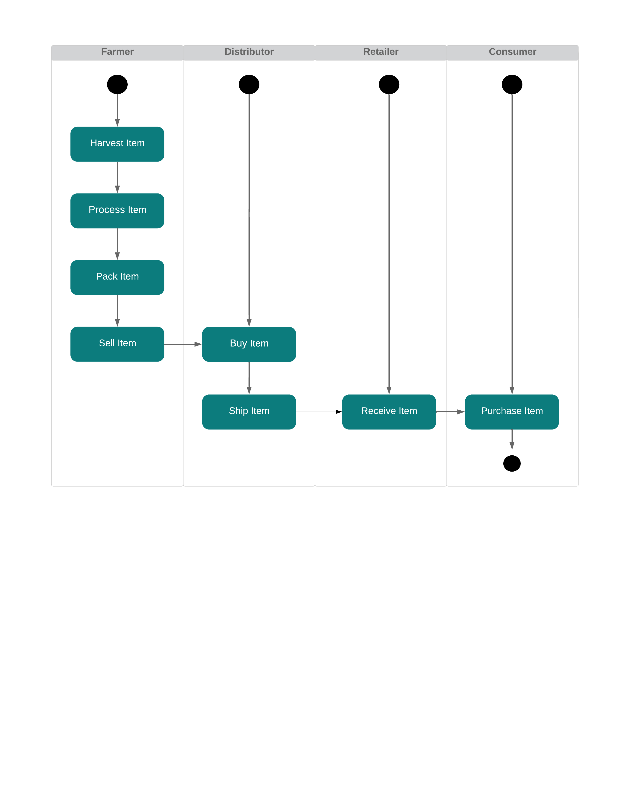

# Supply chain & data auditing

This repository containts an Ethereum DApp that demonstrates a Supply Chain flow between a Seller and Buyer. The user story is similar to any commonly used supply chain process. A Seller can add items to the inventory system stored in the blockchain. A Buyer can purchase such items from the inventory system. Additionally a Seller can mark an item as Shipped, and similarly a Buyer can mark an item as Received.

# The contract Infos

* Contract Address : [0xcb6f83595481855fc8407be8b83802a09b22ce89](https://goerli.etherscan.io/address/0xcb6f83595481855fc8407be8b83802a09b22ce89)
* Transaction ID : [0x8cb6dd6a464eb2c6bde423175e8396899f1a59d8b1c8b484fb89f471a4c99112](https://goerli.etherscan.io/tx/0x8cb6dd6a464eb2c6bde423175e8396899f1a59d8b1c8b484fb89f471a4c99112)


# Project write-up - Libraries & version
* Truffle-hd-wallet-provider ```1.0.6```
* Truffle ```v4.1.14 (core: 4.1.14)```
* Solidity ```v0.4.24 (solc-js)```
* Ganache CLI ```v6.12.2 (ganache-core: 2.13.2)```
* Node ```v16.13.2```

# Project write-up - UML
## Sequence


## Activity


## State


## Class


# IPFS
No IPFS used in this project

# Front End


## Getting Started

These instructions will get you a copy of the project up and running on your local machine for development and testing purposes. See deployment for notes on how to deploy the project on a live system.

### Prerequisites

Please make sure you've already installed ganache-cli, Truffle and enabled MetaMask extension in your browser.

```
Give examples (to be clarified)
```

### Installing

> The starter code is written for **Solidity v0.4.24**. At the time of writing, the current Truffle v5 comes with Solidity v0.5 that requires function *mutability* and *visibility* to be specified (please refer to Solidity [documentation](https://docs.soliditylang.org/en/v0.5.0/050-breaking-changes.html) for more details). To use this starter code, please run `npm i -g truffle@4.1.14` to install Truffle v4 with Solidity v0.4.24. 

A step by step series of examples that tell you have to get a development env running

Clone this repository:

```
git clone https://github.com/udacity/nd1309/tree/master/course-5/project-6
```

Change directory to ```project-6``` folder and install all requisite npm packages (as listed in ```package.json```):

```
cd project-6
npm install
```

Launch Ganache:

```
ganache-cli -m "spirit supply whale amount human item harsh scare congress discover talent hamster"
```

Your terminal should look something like this:


In a separate terminal window, Compile smart contracts:

```
truffle compile
```

Your terminal should look something like this:


This will create the smart contract artifacts in folder ```build\contracts```.

Migrate smart contracts to the locally running blockchain, ganache-cli:

```
truffle migrate
```

Your terminal should look something like this:


Test smart contracts:

```
truffle test
```

All 10 tests should pass.


In a separate terminal window, launch the DApp:

```
npm run dev
```

## Built With

* [Ethereum](https://www.ethereum.org/) - Ethereum is a decentralized platform that runs smart contracts
* [Truffle Framework](http://truffleframework.com/) - Truffle is the most popular development framework for Ethereum with a mission to make your life a whole lot easier.


## Authors

[Omer NAPPORN](https://github.com/omeruis) 
## Acknowledgments

* Solidity
* Ganache-cli
* Truffle
* IPFS
